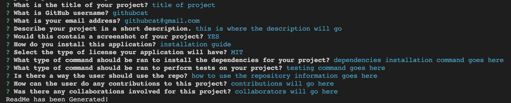

# README-Generator
   

**Description**: This project consists of the build of a README.md generator that is ran as a Node.js application using the Command Line Interface. The generator built will prompt the user for information about their project and it will generate a README.md file that can be used in a repository from GitHub.

**Link for the video tutorial**:
- https://drive.google.com/file/d/1a6v-JJ1kXDvfoFrCt-K4jWEslD3z0oIC/view?usp=share_link

## Table of Contents
* [Installation](#installation)
* [Usage](#usage)
* [License](#license)
* [Contributions](#contributions)
* [Testing](#testing)
* [Questions](#questions)
* [Credits](#credits)

## Installation
1. Download [Node.js](https://node.js.org/en/download/), [git](https://git-scm.com/downloads), and [npm](https://docs.npmjs.com/downloading-and-installing-node-js-and-npm).
2. The user has to clone the repository by typing `git clone https://github.com/itsrayito/README-Generator.git` in the chosen directory the user has chosen into the Command Line Interface.
3. At last, the user has to download npm dependencies by typing `npm install` in the Command Line Interface. This application will use the inquirer npm package version `inquirer 8.2.4`

## Usage
To use this application, the user has to go to the root folder inside the repository they cloned and type `node index` in to the Command Line Interface. This will then prompt the application by asking a series of questions to the user as shown below.  
**Screenshot of the application**:

## License
MIT License

## Contributions
At this time, there is no need for contributions.

## Testing
This application can be tested out using the Command Line Interface.

## Questions
You can [email](rayito.aguirre94@gmail.com) me if there is any questions or comments that arise from this application. 
You can also get a hold of me through my [GitHub](https://github.com/itsrayito) account.

## Credits
This application was made by Rayito Aguirre  
Lecture videos and class sessions on Node.js provided by Rice University Coding Bootcamp in partnership with edX.  
Starting code was made by [Grace Choi](https://github.com/gachoi06) & [Xander Rapstine](https://github.com/Xandromus) and provided to us by Rice University to clone.
